# full-cycle-2.0-keycloak

Files I produced during the Keycloak / OAuth2 / OpenID Connect classes of my [Microservices Full Cycle 3.0 course](https://drive.google.com/file/d/1bJnFxQPKgSsI30sCvW-KzYK4V5JWzgSs/view?usp=share_link).

## Running Keycloak container

```sh
docker run -p 8080:8080 -e KEYCLOAK_USER=admin -e KEYCLOAK_PASSWORD=admin quay.io/keycloak/keycloak
```

## Creating a Realm

Realm is a concept in Keycloak that refers to an object managing a set of users along with their credentials, roles and groups. A Realm works like a tenant. Multiple clients can be interested in accessing users data from a Realm.

Access http://localhost:8080/auth/admin/ on your browser and login with admin/admin.

The Master Realm is used to manage Keycloak itself. We will create a new Realm from it.

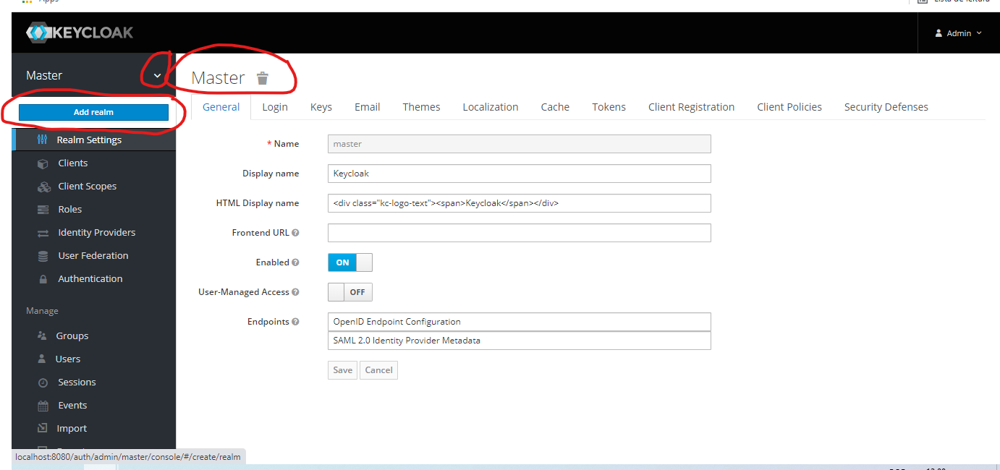

Use myrealm as the name and create.

## Creating an User

Now, create an user inside myrealm.

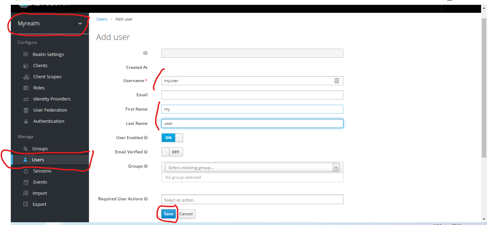

And set its credentials.

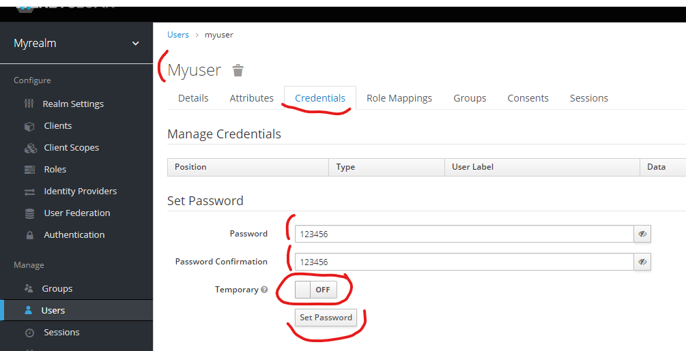

## Creating a Client

Create a client for our Go application.

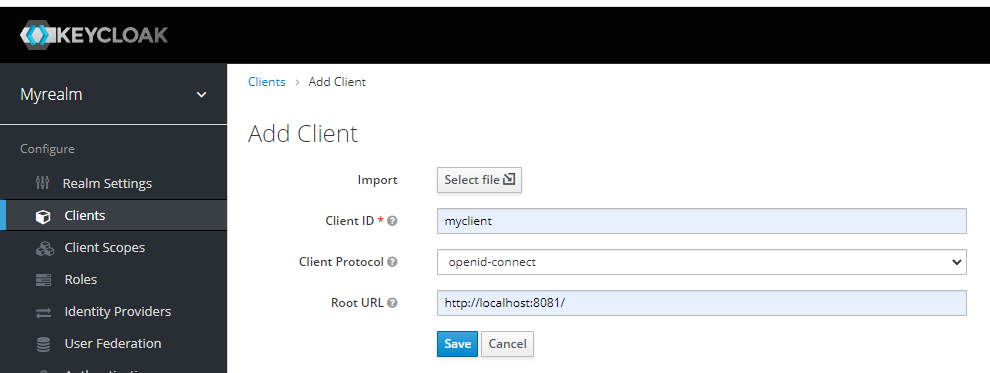

After creating, change the client access type to confidential and save.

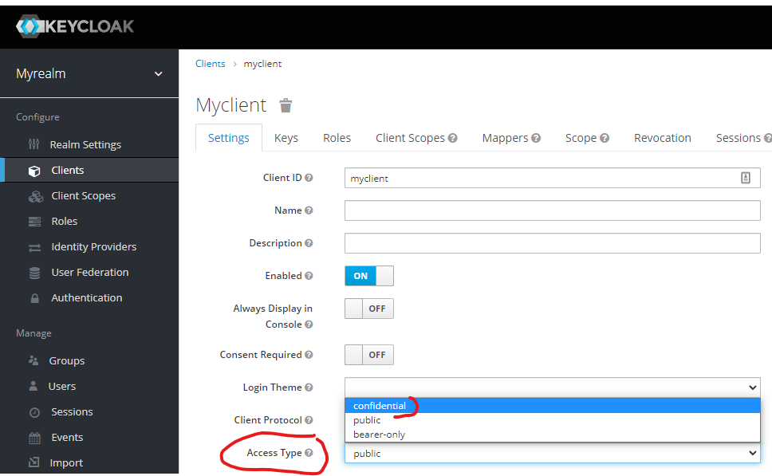

Get the client secret and replace in `goclient/main.go`.

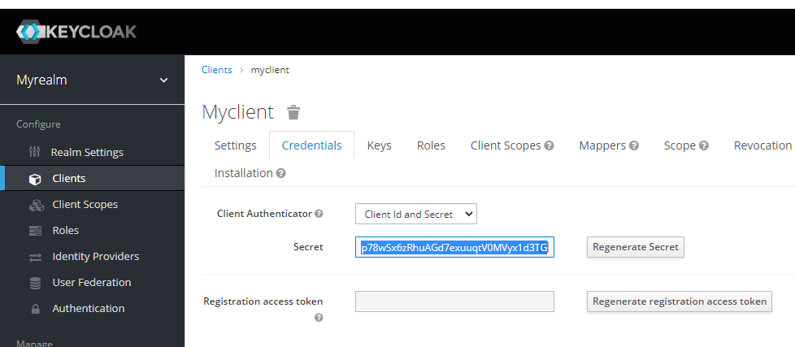

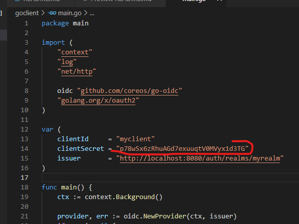

You also need to get the issuer URL from the Realm Settings and replace in `goclient/main.go`.

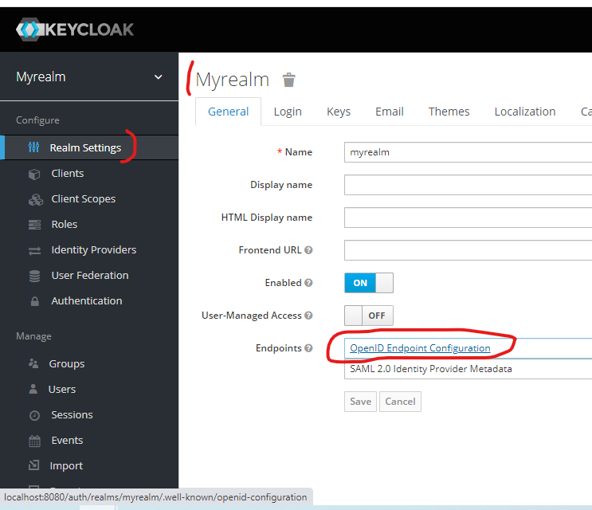

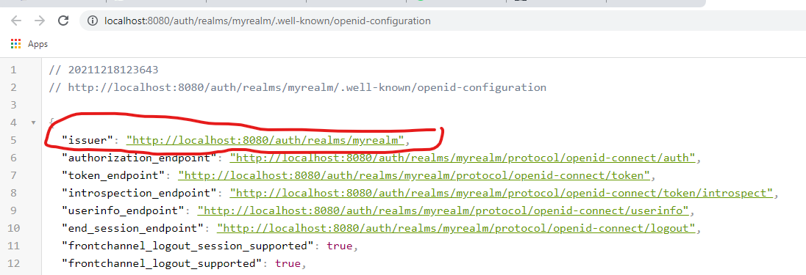

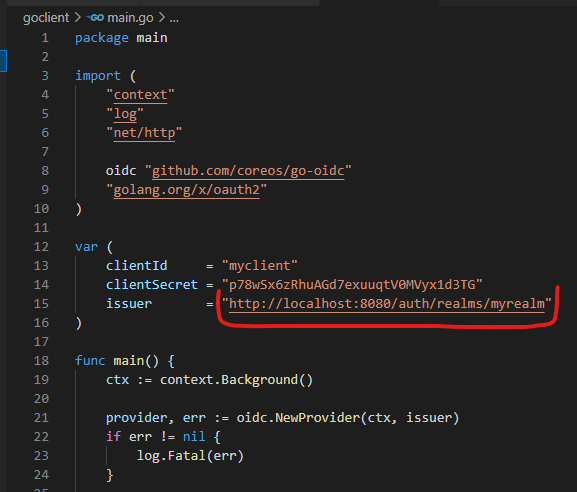

## Running the client

```sh
go mod tidy
go run goclient/main.go
```

Access http://localhost:8081/ on your browser and login in with the same user you created in the realm.

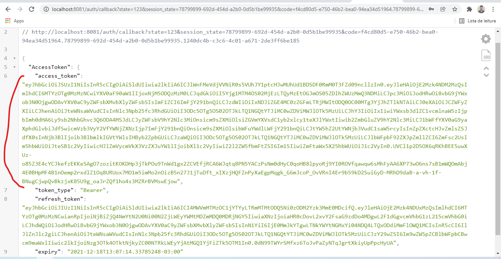

You can go to https://jwt.io to see the access token payload.

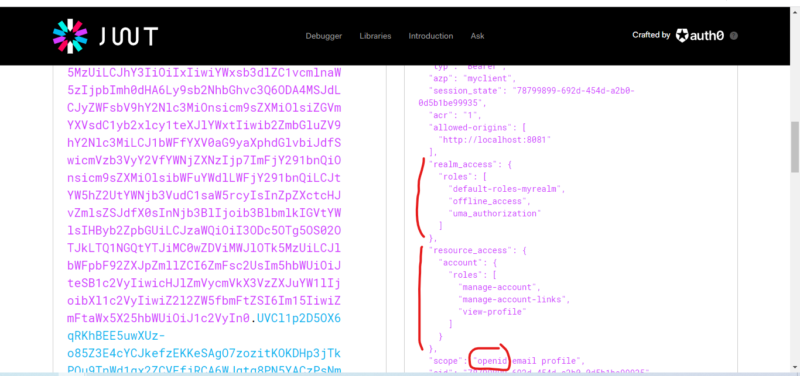

As you can see, this step is the **authorization** step. We can now request the id token as we have access to the openid scope. With the id token, we are **authenticated**.

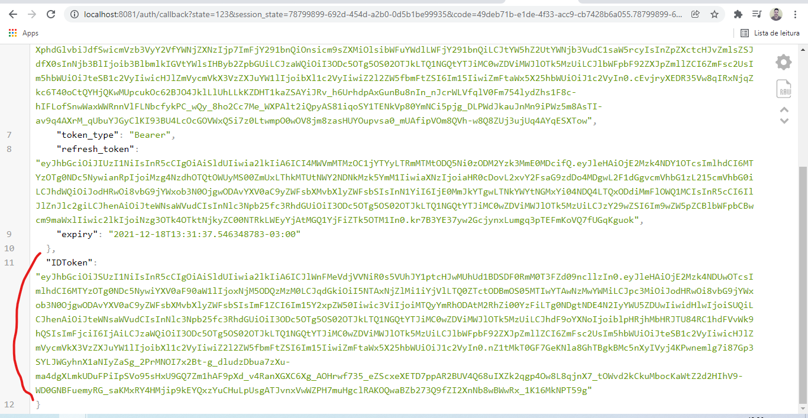

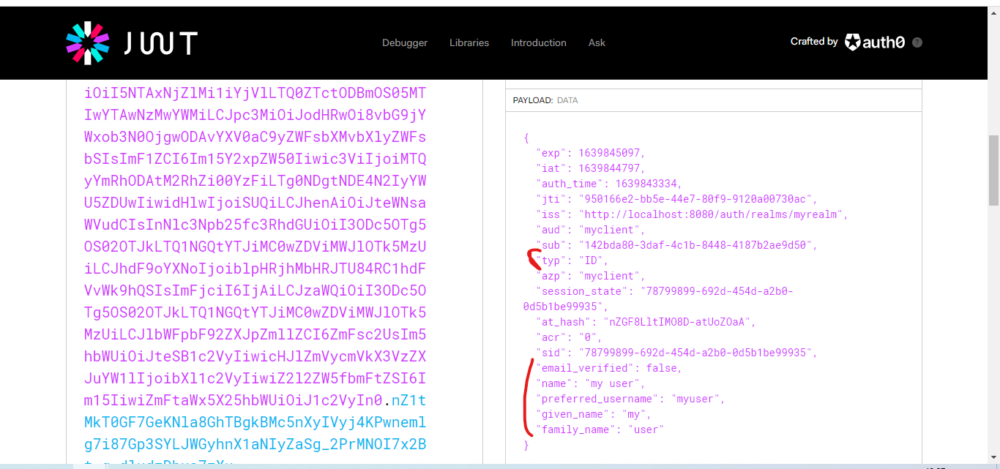
